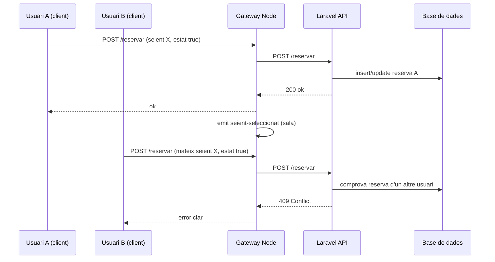

# Nucli de temps real: servidor com a font de veritat i paper de Socket.IO

Aquest document cobreix el **punt 1** de `pendents-respecte-enunciat.md` (*Nucli: temps real, concurrència, servidor com a veritat*): com està implementat al projecte i com **justificar** el disseny davant de l’enunciat (especialment el matís «reserva via Socket.IO»).

---

## 1. Principi fonamental

| Regla de l’enunciat | Implementació |
|---------------------|----------------|
| El **servidor** és l’única font de veritat | **Laravel** persisteix reserves (`reserves_temporals`), compres (`compres_entrades`) i valida cada operació abans d’acceptar-la. |
| El **client no pot forçar** un estat | Les peticions van amb **Sanctum** (`POST /api/reservar`, `POST /api/comprar`); el client només envia intenció; la resposta (200/409/422…) ve del backend. |
| **Socket.IO** per sincronitzar molts clients | El **gateway Node** emet esdeveniments a les **sales** (`sessio:{id}`) i **pel·lícules** (`pelicula:{id}`) quan el domini ja ha canviat (o quan Redis rep el missatge des de Laravel). |

---

## 2. Per què la reserva no és «només» un missatge Socket.IO

L’enunciat pot llegir-se com si la reserva s’enviés **directament** per WebSocket. Aquí el flux és:

1. **Petició HTTP** (des del frontend cap al **gateway** o cap a Laravel, segons `NUXT_PUBLIC_GATEWAY_URL`): `POST .../reservar` amb cos `{ sessioId, seientId, estat }` i capçalera `Authorization`.
2. **Laravel** (`CompraController::reservarTemporal`):
   - comprova usuari autenticat;
   - si `estat === true`, mira si un **altre** usuari té reserva vàlida del mateix seient → **409** *Seient ja reservat per un altre usuari*;
   - si és vàlid: `updateOrCreate` a `reserves_temporals` amb `expires_at`;
   - crida `TempsRealService::notificarSeleccionat` / `notificarAlliberat` (publicació a **Redis**).
3. **Gateway Node**:
   - en la ruta `POST /api/reservar`, si Laravel respon `ok`, també pot emetre `seient-seleccionat` / `seient-alliberat` a la sala Socket.IO;
   - **paral·lelament**, el subscriptor **Redis** del mateix canal rep els esdeveniments que Laravel publica i els reenvia a Socket.IO (doble via coherent: mateix significat).

Això **no trenca** l’esperit de l’enunciat: la **decisió** és sempre al servidor; Socket.IO és el **mitjà de difusió** de l’estat ja validat. Es pot dir: *«La reserva es demana per API REST autenticada; Socket.IO només replica l’estat als clients de la sala.»*

---

## 3. Esdeveniments en temps real (resum)

| Esdeveniment Socket.IO (client) | Origen típic | Ús a la UI |
|---------------------------------|--------------|------------|
| `seient-seleccionat` | Laravel → Redis → Node / o resposta proxy `POST /reservar` | `butaques.vue`: marcar seient com a seleccionat per un altre usuari. |
| `seient-alliberat` | Mateix flux quan s’allibera reserva | Actualitzar mapa. |
| `compra-creada` | Després de compra vàlida | Marcar seients com a venuts, buidar selecció local si cal. |
| `aforo-actualitzat` | Canvis d’aforament | `index.vue`, `sala.vue`. |
| `catalog-actualitzat` | Canvis de catàleg (admin) | Refrescar llistes. |

Els clients es **uneixen** a les sales amb `emit('unirse-sessio', sessioId)` (veure `useSocket.js` i `backend-node/index.js`).

---

## 4. Concurrència: dos usuaris, un seient

Flux lògic:

El **segon** no obté el seient: la resposta ve del **servidor**, no d’una cursa al navegador.

---

## 5. Caducitat de la reserva

- `expires_at` a `reserves_temporals` (renovació en cada reserva segons la lògica del controlador).
- Comanda o tasques que alliberen reserves expirades (veure `AlliberarReservesExpirades` al backend).
- El temporitzador visible al **pagament** / UX és complementari; la **veritat** segueix sent la BD.

---

## 6. Fitxers de referència ràpida

| Àrea | Fitxers |
|------|---------|
| Reserva / conflicte | `backend-laravel/app/Http/Controllers/CompraController.php` |
| Temps real → Redis | `backend-laravel/app/Services/TempsRealService.php` |
| Gateway HTTP + Socket | `backend-node/index.js` (`POST /reservar`, `POST /comprar`, subscripció Redis) |
| Client | `frontend/composables/useSocket.js`, `frontend/pages/butaques.vue` |

---

## 7. Text curt per a la memòria o l’exposició (copiar/adaptar)

> *El sistema garanteix concurrència segurança delegant totes les decisions d’estat a Laravel. Les peticions de reserva i compra es fan per API HTTP autenticada; Socket.IO s’utilitza per difondre immediatament els canvis a tots els clients connectats a la mateixa sessió, de manera que la interfície reflecteix l’estat real sense que el navegador el decideixi. Això compleix l’objectiu de temps real i evita condicions de cursa al client.*

---

*Generat com a tancament del punt 1 del checklist d’enunciat.*
